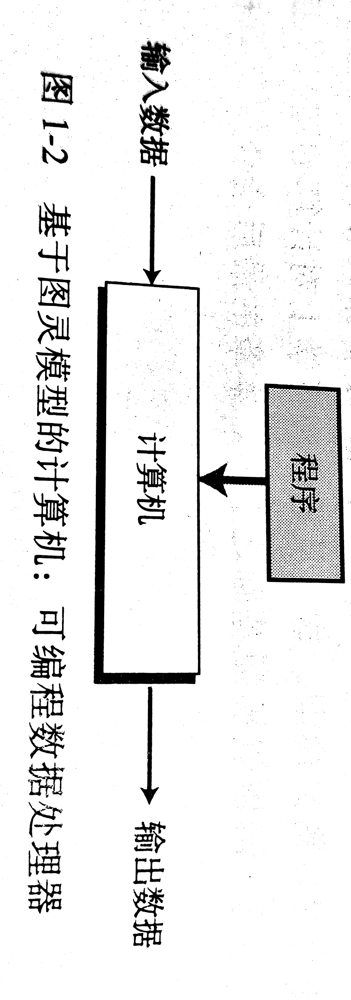
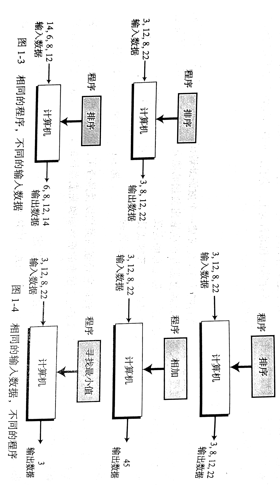
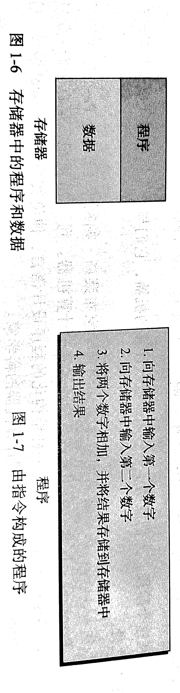

# 第1章  绪论

#### 1.1  图灵模型

​	Alan Turing（阿兰·图灵）在1936年最先提出了一个通用计算机设备的设想。他认为，所有的计算机都可以在一种特殊的机器上执行。这就是现在所说的**图灵机**。尽管图灵对这样一种机器进行了数学上的描述。但他还是更有兴趣关注计算的哲学定义，而不是建造一台真实的机器。他将该模型建立在人们进行计算过程的行为上 ，并将这些行为抽象到用于计算的机器的模型中，这才真正改变了世界。

##### 1.1.1  数据处理器

​	在讨论图灵模型之前，让我们把计算机定义成一个**数据处理器**。依据这种定义，计算机可以被看做一个接受输入数据、处理数据并产生输出数据的黑盒。尽管这个模型能够体现现代计算机的功能，但是它的定义还是太宽泛。按照这种定义，也可以认为便携式计算器是计算机（按照字面意思，它也符合定义的模型）

​	另一个问题是这个模型并没有说明它处理的类型以及是否可以处理一种以上的类型。换句话说，它并没有清楚地说明基于这个模型的机器能够完成操作的类型和数量。它是专用机器还是通用机器呢？

​	这种模型可以表示为一种设计用来完成特定任务的专用计算机（或者处理器），比如用来控制建筑物温度或汽车油料的使用。尽管如此，计算机作为一个当今使用的术语，是一种 ***通用的*** 机器，它可以完成各种不同的工作。这表明我们须要讲该模型改变为图灵模型来反映当今计算机的现实。

##### 1.1.2  可编程数据处理器

​	图灵模型是一个适用于通用计算机的更好的模型。该模型添加了一个额外的元素—— ***程序*** ——到不同的计算机器中。**程序**是用来告诉计算机如何对数据进行处理的指令集合。
图 1-2 显示了图灵模型。

​	在这个图灵模型中，输出数据依赖于两方面因素的结合作用：**输入数据**和程序。对于相同的输入数据，如果改变程序，则可以产生不同的输出。类似地，对于同样的程序，如果改变输入数据，其输出结果也将不同。最后，如果输入数据和程序保持不变，输出结果也将不变。让我们看看下面三个示例。

​	**1.相同的程序，不同的输入数据**
​	图 1-3 显示了对于同样的程序输入不同的数据时，尽管程序相同，但因为处理的输入数据不同，输出也就不同。
​	**2.相同的输入数据，不同的程序**
​	图 1-4 显示了程序不同输入数据相同时的情形。每个程序使计算机对于相同的输入数据执行不同的操作。第一个程序是使输入数据按大小顺序排列，第二个程序是使所有的数据相加，第三个程序是找出输入数据中最小的数。

​	**3.相同的输入数据，相同的程序**
​	我们希望无论何时，对于同样的输入数据和程序，其输出结果一致。换句话说，当输入相同的数据运行程序时，我们希望有相同的输出。

##### 1.1.3通用图灵机

​	***通用图灵机*** 是对现代计算机的首次描述，只要提供了合适的程序，该机器就能做任何运算。可以证明,一台很强大的计算机和通用图灵机一样能进行同样的运算。我们所需要的仅仅是为这两者提供数据以及用于描述如何做运算的程序。实际上，通用图灵机能做任何可计算的运算。

#### 1.2  冯·诺依曼模型

​	基于通用图灵机建造的计算机都是在存储器中存储数据。在1944~1945年，冯·诺依曼指出，鉴于程序和数据在逻辑上是相同的，程序也能存储在计算机的存储器中。

##### 1.2.1  4个子系统

​	基于冯·诺依曼模型建造的计算机分为4个子系统：存储器、算术逻辑单元、控制单元和输入/输出（见图 1-5 ）。

​	**1.存储器**	
​	**存储器**是用来存储的区域，在计算机的处理过程中存储器用来存储数据和程序，我们将在后面讨论存储数据和程序的原因。
​	**2.算数逻辑单元**
​	**算术逻辑单元（ALU）**是用来计算和**逻辑运算**的地方。如果是一台数据处理计算机，它应该能对数据进行算术运算（例如进行一系列的数字相加运算）。当然它也应该可以对数据进行一系列逻辑运算，正如我们将在第4章看到的那样。
​	**3.控制单元**
​	**控制单元**是对**存储器**、算术逻辑单元、输入/输出等子系统进行控制操作的单元。
​	**4.输入/输出** 
​	**输入子系统**负责从计算机外部接收输入数据和程序，**输出子系统**负责将计算机的处理结果输出到计算机外部。输入/输出子系统的定义相当宽泛，他们还包含辅助存储设备，例如，用来存储处理所需的程序和数据的磁盘和磁带等。当一个磁盘用于存储处理后的输出结果时， 我们一般就可以认为它是输出设备，如果从该磁盘上读取数据，责改磁盘就该认为是输入设备。

##### 1.2.2  存储程序概念

​	冯· 诺依曼要求程序必须存储在存储器中。这和早期只有数据才能存储在存储器中的计算机结构完全不同。完成某一任务的程序是通过操作一系列的开关或改变其配线来实现的。

​	现代计算机的存储器用来存储程序及其相应数据。这意味着数据和程序应该具有相同的格式，这是因为它们都存储在存储器中。实际上它们都是以 ***位模式*** （0和1序列）存储在存储器中的。

##### 1.2.3  指令的顺序执行	

​	冯·诺依曼模型中的一段程序由一组数量有限的指令组成。按照这个模型，控制单元从存储器中提取一条指令，解释指令，接着执行指令。换句话说，指令就是一条接着一条的顺序执行，当然，一条指令可能会请求控制单元跳转到其前面或者后面的指令去执行，但是这并不意味着指令没有按照顺序来执行。指令的顺序执行是基于冯·诺依曼模型的计算机的初始条件。当今的计算机以最高效的顺序来执行程序。

#### 1.3  计算机组成部分

​	我们可以认为计算机由三大部分组成：计算机硬件、数据和计算机软件。

##### 1.3.1  计算机硬件

​	当今的计算机硬件基于冯·诺依曼模型，且包含四部分，尽管可以有不同类型的存储器，不同类型的输入/输出子系统等。在第5章我们将详细讨论计算机硬件。

##### 1.3.2  数据

​	冯·诺依曼模型清楚地将一台计算机定义为一台数据处理机。它接收输入数据，处理并输出相应的结果。
​	**1.存储数据**
​	冯·诺依曼模型并没有定义数据如何存储在计算机中。如果一台计算机是一台电子设备，最好的数据存储方式应该是电子信号，例如以电子信号的出现与消失的特定方式来存储数据，这意味着一台计算机可以以两种状态之一的形式来存储数据。
​	显然，日常使用的数据并不是以两种状态之一存在的。例如，我们在数字系统中使用的数字可以是 0~9 十种状态中的任何一个。但是你不能（至少到目前为止），将这类信息存储到计算机内部，除非将这类信息变换成另一种只使用两种状态（0和1）的系统。同样，你也需要处理其他类型的数据（例如文本、图像、声音、视频），他们同样不能直接存储到计算机中，除非将它们转变成合适的形式（0 和 1 序列）。
​	在第3章中，我们将会了解不同类型的数据是怎样以 0 和 1 序列的二进制形式存储在计算机内部的。第4章将介绍在计算机内部由二进制组成的数据是怎样被操作的。
​	**2.组织数据**
​	尽管数据只能以一种形式（位模式）存储在计算机内部，但在计算机外部却可以表现为不同的形式。另外，计算机（以及数据处理表示法）开创了一个新兴的研究领域—— ***数据组织*** 。在将数据存储到计算机中之前，能否有效地将数据组织成不同的实体和格式？如今，数据并不是按照杂乱无章的次序来组织信息的。数据被组织成许多小的单元，再由这些小的单元组成更大的单元，等等。在第 11~14 章中，我们将会从这个角度去认识数据。

##### 1.3.3  计算机软件

​	图灵或冯·诺依曼模型的主要特征是 ***程序*** 的概念。尽管早期的计算机并没有在计算机的存储器中存储程序，但它们还是使用了程序的概念。 ***编程*** 在早期的计算机系统中体现为一系列开关的打开或闭合以及配线的改变。编程在数据实际开始处理之前是由操作员或工程师完成的一项工作。
​	**1.程序必须是被存储的**
​	在冯·诺依曼模型中，这些程序被存储在计算机的存储器中，存储器中不仅要存储数据，还要存储程序（见图 1-6 ）。
​	**2.指令的序列**
​	这个模型还要求程序必须是有序的指令集。每一条指令操作一个或多个数据项。因此，一条指令可以改变它前面指令的作用。例如，图 1-7 显示了一个输入两个数据，将它们相加，最后打印出结果的程序。这段程序包含4个独立的指令集。

​	也许我们会问：为什么程序必须由不同的指令集组成？答案是重用性，如今计算机完成成千上万的任务，如果每一项任务的程序都是相对独立的，且和其他程序之间没有任何的公用段，编程将会变成一件很困难的事情。图灵模型和冯·诺依曼模型通过仔细的定义计算机可以使用的不同指令集，使编程变得相对简单。程序员通过组合这些不同的指令来创建任意数量的程序。每个程序可以是不同指令的不同组合。

​	**3.算法**
​	要求程序包含一系列指令使编程变的可能，但也带来了另外一些使用计算机方面的问题。程序员不仅要了解每一条指令所完成的任务，还要知道怎样将这些指令结合起来完成特定的任务。对于一些不同的问题，程序员首先应该以循序渐进的方式来解决问题，接着尽量找到合适的指令（指令序列）来解决问题。这种按步骤解决问题的方法就是所谓的**算法**。算法在计算机科学中起到了重要的作用，我们将在第8章讨论。
​	**4.语言**
​	在计算机时代的早期，只有一种称为 ***机器语言*** 的计算机语言。程序员依靠写指令的方式（使用位模式）来解决问题。但是随着程序越来越大，采用这种模式来编写很长的程序变得单调乏味。计算机科学家研究出利用符号来代表位模式，就像人们在日常中用符号（单词）来代表一些常用的指令一样。当然，人们在日常生活中所用的一些符号与计算机中所用的符号不同。这样**计算机语言**的概念便诞生了。自然语言（例如英语）是丰富的，并有许多正确组合单词的规则；相对而言，计算机语言只有比较有限的符号与单词。第9章将介绍计算机语言。
​	**5.软件工程**
​	在冯·诺依曼模型中没有定义**软件工程**，软件工程是指结构化程序的设计和编写。今天，它不仅仅是用来描述完成某一任务的应用程序，还包括程序设计中所要严格遵循的原理和规则。我们所讨论的这些原理和规则综合起来就是第 10 章中要说的 ***软件工程*** 。
​	**6.操作系统**
​	在计算机演变过程中，科学家们发现有一系列指令对所有程序来说是公用的。例如，告诉计算机在哪里接收和发送数据的指令几乎所有程序都要用到。如果这些指令只编写一次就可以用于所有程序，那么效率将会大大提高。这样，就出现了操作系统的概念。计算机操作系统最初是为程序访问计算机部件提供方便的一种管理程序。今天，操作系统所完成的工作远不止这些，具体的内容将在第 7 章介绍。

#### 1.4  历史

​	在本节中，我们简要回顾一些计算和计算机的历史。我们将其分为三个阶段。

##### 1.4.1  机械计算机机器（1930 年以前）

​	在这个阶段，人们发明了一些用来进行计算的机器，他们与计算机的现代概念几乎没有相似之处。

-  在17世纪，法国著名的数学家和物理学家布莱斯·帕斯卡（**Blaise Pascal**）发明了**Pascaline**,这是一个用来进行加减运算的计算机器。到了20世纪，尼克劳斯·沃斯（**Niklaus Wirth**）发明了一种结构化的程序设计语言，他将其命名为**Pascal**语言，用来纪念这位发明首台机械计算机器的科学家。
-  在17世纪后期，德国数学家戈特弗里德·莱布尼茨（**Gottfried Leibnitz**）发明了一台既能够做乘除运算又能够做加减运算的更加复杂的计算机器，这台机器被称为莱布尼茨之轮（**Leibnitz's Wheel**）。
- 第一台利用存储和编程概念的机器是雅卡尔提花织机（**Jacquard loom**），它是由约瑟夫-玛丽·雅卡尔（**Joseph-Marie Jacquard**）在19世纪初期发明的。这种织机利用穿孔卡（类似于存储程序）来控制织布过程中经线的提升。
- 1823年，查尔斯·芭比奇（**Charles Babbage**）发明了一种差分引擎，它不仅能够很容易的进行数学运算，还可以解多项式方程。后来，他发明了一种叫做分析引擎的机器，在某种程度上和现代计算机的概念类似。该机器由四个部分组成：制造场（现在的逻辑算数单元）、存储单元（存储器）、操作者（控制单元）和输出单元（输入/输出）。
- 1890年，在美国人口普查办公室工作的赫尔曼·何勒里斯（**Herman Hollerith**）设计并制造出具有编程能力的机器，该机器可以自动阅读、计数和排列存储在穿孔卡上的数据。

##### 1.4.2  电子计算机的诞生（1930~1950年）

​	1930~1950年，那些被视为电子计算工业先驱的科学家们发明了一些计算机。
​	**1.早期的电子计算机**
​	这一时期的早期计算机并不是将程序存储到存储器中，所有的计算机都是在外部进行编程的。有以下5种比较杰出的计算机：

- 第一台用来完成特定任务的计算机是通过将信息进行电子编码来实现其功能的，它是由约翰·阿塔纳索夫（**John V.Atanasoff**）及其助手克利福德·贝里（**Clifford Berry**）于1939年发明的。它又被称为ABC（Atanasoff Berry Computer）,主要用于实现解线性方程组。
- 在同一时期，名为康拉德·朱斯（**Konrad Zuse**）的德国数学家设计出通用计算机，并命名为” Z1“。
- 在20世纪30年代，美国海军和IBM公司在哈佛大学发起了一项工程，在霍德华·艾肯（**Howard Aiken**）的直接领导下建造了一台名为Mark I 的巨型计算机。这种计算机即使用了电子部件，也使用了机械部件。
- 在英国，阿兰·图灵发明了一台名为巨人(**Colossus**)的计算机，这台计算机是为破译德国Enigma密码而设计的。 
- 第一台通用的、完全电子的计算机由约翰·莫奇勒（**John Mauchly**）和普雷斯波·埃克特（J.Presper Eckert）发明，这台计算机被称为 ENIAC （**Electronic Numerical Integrator and Calculator,电子数字积分器和计算器**）。它是在1946年完成设计的，利用了将近18000个真空管，有100英尺长，10英尺高，重达30吨。

​	**2.基于冯·诺依曼模型的计 算机**

​	前面5种计算机的存储器仅仅用来存放数据，它们利用配线或开关进行外部编程。冯·诺依曼提出程序和数据应该存储在存储器中。按照这种方法，每次使用计算机来完成一项新的任务。你只需要改变程序，而不用重新布线或者调节成百上千的开关。

​	第一台基于冯氏思想的计算机于1950年在宾夕法尼亚大学诞生，命名为 EDVAC 。与此同时，英国剑桥大学的莫里斯·威尔克斯（**Maurice Wilkes**）制造了同样类型的被称为 EDSAC 的计算机。

##### 1.4.3  计算机的诞生（1950年至今）

​	1950年以后出现的计算机都差不多基于冯·诺依曼模型。它们变得更快、更小、更便宜，但原理几乎是相同的。历史学家将这一时期分为几代，每一代计算机的改进主要体现在硬件或软件方面（而不是模型）。

​	**1.第一代计算机**

​	第一代计算机（大约1950~1959年）以商用计算机的出现为主要特征。在这个时期，计算机只有专家们才能使用。它们被锁在房子里，限制操作者和计算机专家以外的人员进入。计算机体积庞大，且使用真空管作为电子开关。此时的计算机只有大的机构才能负担得起。

​	**2.第二代计算机**

​	第二代计算机（大约1959~1965年）使用晶体管代替了真空管。这既减小了计算机的体积，也节省了开支，从而使得中小型企业也可以负担得起。FORTRAN 和 COBOL（参见第9章）这两种高级计算机程序设计语言的发明使得编程更加容易。这两种语言将编程任务和计算机运行任务分离开来。例如，土木工程师能够直接编写一个 FORTRAN 程序来解决问题，而不必涉及计算机结构中的具体电子细节。

​	**3.第三代计算机**

​	**集成电路**（晶体管、导线以及其它部件放在一块单芯片上）的发明更加减少了计算机的成本和大小。 ***小型计算机*** 出现在市场上。封装的程序，就是通常所说的软件包已经有售。小型公司可以买到需要的软件包（如会计程序）。而不必写自己的程序。一个新的行业——软件行业就此诞生了。这个时期大概从1965年持续到1975年。

​	**4.第四代计算机**

​	第四代计算机（大约1975~1985年）出现了 **微型计算机** 。第一个桌面计算器（**Altair8800**）出现在1975年。电子工业的发展允许整个计算机子系统做在单块电路板上。这一时期还出现了计算机网络（参见第6章）。

​	**5.第五代计算机**

​	这个还未终止的时代始于1985年。 这个时代见证了掌上计算机和台式计算机的诞生、第二代存储媒体（CD-ROM、DVD等）的改进、多媒体的应用以及虚拟现实现象。

#### 1.5  计算机科学作为一门学科

​	随着计算机的发明，带来可新的学科：***计算机科学*** 。如同其他任何科学一样，计算机科学现在被划分为几个领域。我们可以把这些领域归纳为两大类： ***系统领域*** 和***应用领域***  。系统领域涵盖那些与硬件和软件构成直接有关的领域，例如 ***计算机体系结构*** 、***计算机网络*** 、***安全问题*** 、***操作系统*** 、***算法*** 、***程序设计语言*** 以及 ***软件工程*** 应用领域涵盖了与计算机使用有关的领域，例如 ***数据库*** 和  ***人工智能*** 。本书对所有这些领域采用广度优先的方式介绍。学完本书之后，读者应该有足够的信息来选择专业方向。

#### 1.6  课程纲要

​	在本章之后，本书分为六大部分。

​	

##### 1.6.1  第一部分：数据的表示与运算

​	该部分包括第2、3和4章。第2章讨论数字系统——数量如何使用符号来表示。第3章讨论不同的数据如何存储在计算机中。第4章讨论一些基本的位运算。

##### 1.6.2 第二部分：计算机硬件

​	这部分包括第5、6章。 第5章给出计算机硬件的通用概念，讨论不同的计算机组成。第6章阐明不同的单个计算机是如何连接成计算机网络以及 ***互联网***

的。本章还特别涉及了与互联网及其应用有关的话题。

##### 1.6.3 第三部分：计算机软件

​	这部分包括第7、8、9和10章。第7章讨论操作系统——一种用户（人或者应用程序）用来控制硬件访问的系统软件。第8章说明问题求解如何归约成该问题编写算法。第9章是当今程序设计语言之旅。最后，第10章是软件工程的概述，这是软件开发的工程方法。

##### 1.6.4 第四部分：数据组织与抽象

​	这部分是对第一部分的补充。在计算机科学中， ***原子数据*** 汇集成记录、文件和数据库。 ***数据抽象*** 使得程序员能够创建关于数据的抽象观念。 第四部分包括第11、12、13和14章。第11章讨论数据结构，即集合相同或不同类型的数据到一个类属中。第12章讨论抽象数据类型。第13章说明不同文件结构是如何用于不同的目的的。最后，第14章讨论数据库。

##### 1.6.5  第五部分：高级话题

​	第五部分给出高级话题的概述，这些话题是计算机科学专业学生在今后的教育中会遇到的。这部分包括第15、16、17和18章。第15章讨论数据压缩，这在今天的数据通信中很普遍。第16章探索与安全有关的问题，当我们通过不安全的信道通信时，安全问题变得越来越重要。第17章讨论计算理论，即哪些是可计算的，哪些是不可计算的。最后，第18张给出一些人工智能的观点，在计算机科学中，这是一个日益受到挑战的话题。

##### 1.6.6  第六部分：社交媒体和社会话题

​	第六部分简要介绍社交媒体和社会话题，这可能是学计算机科学的学生有兴趣去探索的两个话题。

#### 1.7  章末材料

**推荐读物**

​	有关本章所讨论主题的更详细资料，可以参考下列书籍：

- Schneider,G.M.and Gersting,J.L. ***Invitation to Computer Science*** Boston ,MA:Course Technology,2004
- Dale,N.and Lewis,J. ***Computer Science Illuminated*** , Sudbury ,MA :Jones and Bartlett ,2004
- Patt,Y.and Patel ,S. ***Introduction to Computing Systems*** ,New York : McGraw-Hill,2004

**关键术语**

algorithm（算法）

arithmetic logic unit（ALU,算术逻辑单元）

computer languages （计算机语言）

control unit （控制单元）

data processor（数据处理器）

input data （输入数据）

input / output subsystem（输入/输出子系统）

instruction（指令）

integrated circuit（集成电路）

logical operation（逻辑运算）

memory（存储器）

microcomputer（微处理器）

operating system（操作系统）

output data（输出数据）

program （程序）

structured programs（结构化程序）

software engineering（软件工程）

Turing machine（图灵机）

Turing model（图灵模型）

von Neumann model（冯·诺依曼模型）

**小结**

- 阿兰·图灵在1936年首次提出了一个通用的计算设备的设想。他设想所有的计算都可能在一种特殊的机器上执行，这就是现在所说的图灵机。
- 基于冯·诺依曼模型建造的计算机分为4个子系统：存储器、算术逻辑单元、控制单元和输入/输出。冯·诺依曼模型指出，程序必须存储在存储器中。
- 我们可以认为计算机由三大部分组成：计算机硬件、数据和计算机软件。
- 计算和计算机的历史可分为三个阶段：机械计算机器阶段（1930年以前），电子计算机阶段（1930~1950年），以及包括5代现代计算机的阶段。
- 随着计算机的发明，带来了新的学科：计算机科学。如同任何其他学科一样，计算机科学现在被划分为几个领域。

#### 1.8  练习

**小测验**

​	在本书网站上提供了一套与本章相关的交互式测验题。强烈建议学生在做本章练习前首先完成相关测验题以检测对本章内容的理解。

**复习题**

Q1-1	定义一个基于图灵模型的计算机。

Q1-2	定义一个基于冯·诺依曼模型的计算机。

Q1-3	在基于图灵模型的计算机中，程序的作用是什么？

Q1-4	在基于冯·诺依曼模型的计算机中，程序的作用是什么？

Q1-5	计算机中有哪些子系统？

Q1-6	计算机中存储器子系统的功能是什么？

Q1-7	计算机中ALU子系统的功能是什么？

Q1-8	计算机中控制单元子系统的功能是什么？

Q1-9	计算机中输入/输出子系统的功能是什么？

Q1-10	简述5代计算机。

**练习题**

P1-1	解释为什么计算机不能解决那些计算机外部世界无解决方法的问题。

P1-2	如果一台小的便宜的计算机可以做大型昂贵的计算机能做的同样事情，为什么人们还需要大的呢？

P1-3	研究 Pascaline 计算机，看看它是否符合图灵模型。

P1-4	研究莱布尼茨之轮，看看它是否符合图灵模型。

P1-5	研究雅卡尔提花织机，看看它是否符合图灵模型。

P1-6	研究查尔斯·巴比奇分析引擎，看看它是否符合冯·诺依曼模型。

P1-7	研究ABC计算机，看看它是否符合冯·诺依曼模型。

P1-8	研究并找出键盘起源于哪一代计算机。

